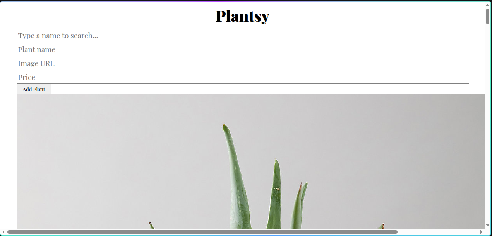

# 🌱 Plantsy App

## Description

Plantsy is a React application that allows users to browse and manage a collection of plants. Users can view available plants, search for plants by name, add new plants using a form, and mark plants as sold out.

This project was built using React Hooks and JSON Server as part of a React code challenge to practice state management, component structure, and working with APIs.

---

## Screenshot

Add a screenshot of the completed application below:



---

## Features

- Displays all plants on page load
- Search plants by name
- Add new plants dynamically
- Mark plants as sold out
- Updates UI without refreshing the page

---

## Technologies Used

- React
- JavaScript (ES6)
- HTML
- CSS
- JSON Server
- Vite

---

## Installation

Clone the repository:

```bash
git clone <your-repository-link>

Move into the project directory:

cd react-hooks-plantshop-cr-vite

Install project dependencies:

npm install

Start the JSON server:

npm run server

Start the React application:

npm run dev
Usage

Open the application in the browser.

Users can:

View available plants
Search plants using the search bar
Add a new plant using the form
Mark plants as sold out
Project Structure
src/
│
├── components/
│   ├── PlantCard.jsx
│   ├── PlantList.jsx
│   ├── PlantPage.jsx
│   ├── Search.jsx
│   └── NewPlantForm.jsx
│
├── App.jsx
└── index.css
Learning Goals

This project helped me practice:

React Hooks (useState, useEffect)
State management
Props
Event handling
Form handling# 🌱 Plantsy App

## Description

Plantsy is a React application that allows users to browse and manage a collection of plants. Users can view available plants, search for plants by name, add new plants using a form, and mark plants as sold out.

This project was built using React Hooks and JSON Server as part of a React code challenge to practice state management, component structure, and working with APIs.

---

## Screenshot

Add a screenshot of the completed application below:


---

## Features

- Displays all plants on page load
- Search plants by name
- Add new plants dynamically
- Mark plants as sold out
- Updates UI without refreshing the page

---

## Technologies Used

- React
- JavaScript (ES6)
- HTML
- CSS
- JSON Server
- Vite

---

## Installation

Clone the repository:

```bash
git clone <your-repository-link>

Move into the project directory:

cd react-hooks-plantshop-cr-vite

Install project dependencies:

npm install

Start the JSON server:

npm run server

Start the React application:

npm run dev
Usage

Open the application in the browser.

Users can:

View available plants
Search plants using the search bar
Add a new plant using the form
Mark plants as sold out
Project Structure
src/
│
├── components/
│   ├── PlantCard.jsx
│   ├── PlantList.jsx
│   ├── PlantPage.jsx
│   ├── Search.jsx
│   └── NewPlantForm.jsx
│
├── App.jsx
└── index.css
Learning Goals

This project helped me practice:

React Hooks (useState, useEffect)
State management
Props
Event handling
Form handling
Fetch requests
Working with APIs
Future Improvements

Possible improvements for future versions:

Add delete functionality
Add edit functionality
Add plant categories
Add user authentication
Connect to a real backend database
Author

Thomas Buko
Fetch requests
Working with APIs
Future Improvements

Possible improvements for future versions:

Add delete functionality
Add edit functionality
Add plant categories
Add user authentication
Connect to a real backend database
Author

Thomas Buko